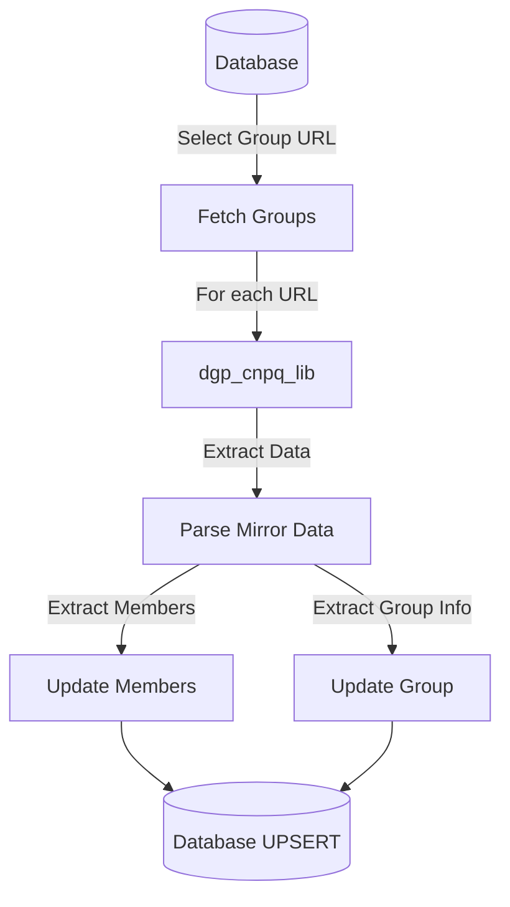
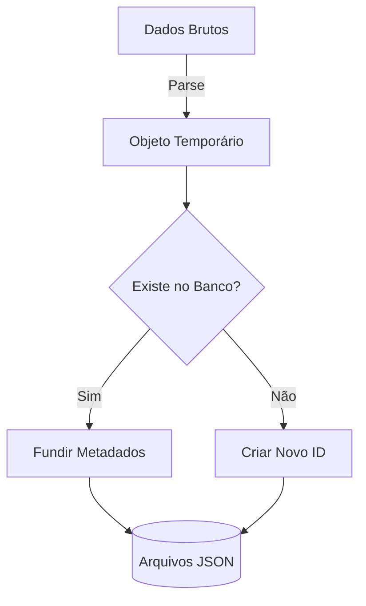
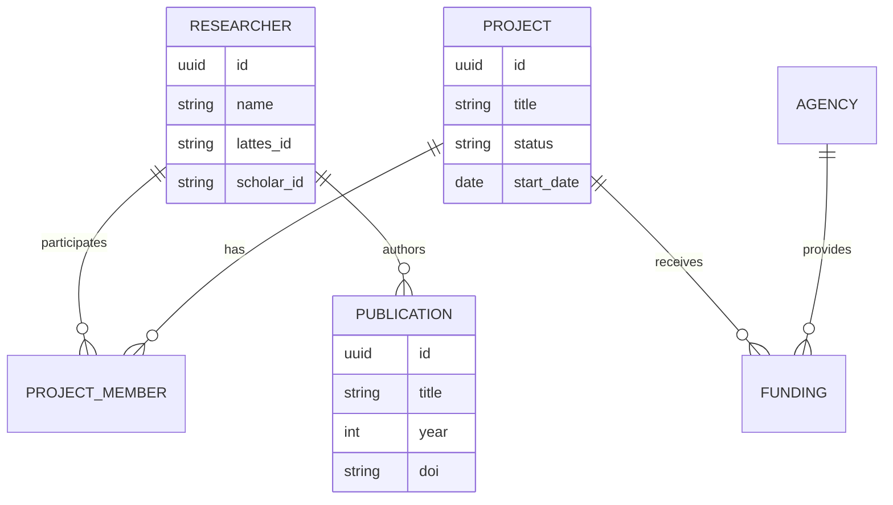

# SI.2 – Análise do Software
**Projeto:** Horizon Dashboard
**Versão:** 1.0
**Responsável:** Antigravity (Senior Analyst)

---

## 1. Objetivo do Documento
Modelar o domínio de Dados Acadêmicos e desenhar os fluxos de consumo de dados.

---

## 2. Entendimento do Domínio
O domínio central é a **Produção Acadêmica e Científica**.
Conceitos Chave:
- **Pesquisador**: Ator central (Professor/Aluno).
- **Produção**: Artigo, Livro, Patente.
- **Projeto**: Iniciativa financiada ou voluntária.
- **Instituição/Órgão**: IFES, FAPES, CNPq.

### 2.1 Stakeholder Personas (UX Design)
| Persona | Objetivos | Necessidades de Dados |
|---------|-----------|-----------------------|
| **Alunos** | Descobrir grupos de pesquisa | Contatos, áreas de atuação, projetos ativos. |
| **Professores** | Visibilidade e colaboração | Produção bibliográfica, índice-h, parcerias. |
| **Gestores** | Monitoramento institucional | KPIs agregados por campus, fomento total. |
| **Empresas** | Prospecção de inovação | Patentes, expertise técnica, laboratórios. |

---

## 3. Modelagem de Processos (ETL Flow)

### 3.2 Fluxo de Atualização CNPq (DGP)

### 3.3 Lógica de Busca Avançada
Para suportar a busca multifatorial, o sistema aplica filtros combinados via JavaScript (Client-side):
1. **Nome do Grupo**: Busca por substring case-insensitive.
2. **Área de Conhecimento**: Filtro por tags exatas ou parciais.
3. **Campus**: Filtro por Nome do campus.
4. **Liderança**: Busca nos nomes dos coordenadores do grupo.

### 3. strategy de Normalização (Lattes/Scholar)

---

## 4. Modelagem de Dados (Canonical JSON)
Diagrama de Entidade-Relacionamento macro para os dados consumidos.

---

## 5. Dicionário de KPIs Acadêmicos (Data Analyst)
| KPI | Definição Técnica | Dimensão |
|-----|-------------------|----------|
| **Impacto de Citação** | Média de citações por publicação (via Google Scholar). | Pesquisa |
| **Capilaridade Geográfica**| Distribuição de egressos por região (CNPq). | Extensão |
| **Índice de Retenção** | Tempo médio de permanência no grupo (Início/Fim). | Pós-Graduação |
| **Fomento Externo** | Volume total de recursos captados (FAPES/Empresas). | Gestão |

---

## 6. Regras de Negócio e UX
| Regra | Descrição | Impacto |
|--------|-------------|----------|
| **RN-01** | **Prioridade de Fonte** | Se dados conflitarem (ex: Título), Lattes tem prioridade sobre Scholar. | Transform Layer |
| **RN-02** | **Desduplicação** | Publicações devem ser desduplicadas por DOI ou Título normalizado. | Load Layer |
| **RN-03** | **Histórico** | Manter log de quando o dado foi extraído/atualizado (`updated_at`). | Database |
| **RN-04** | **Observabilidade** | Todas as ações (Start, End, Error) devem ser logadas com Contexto. | System-wide |

---

## 6. Rastreabilidade (SI.1 → SI.2)
| Requisito | Elemento da Análise |
|-----------|----------------------|
| RF-01 (SigPesq) | Entidade `PROJECT`, Fluxo 3.1 |
| RF-02 (Lattes) | Entidade `RESEARCHER`, `PUBLICATION`, Fluxo 3.2 |
| RF-08 (Canonical JSON) | Fluxo de Exportação (User Req. logic) |
| RF-09 (CNPq Update) | Fluxo 3.2, dgp_cnpq_lib |