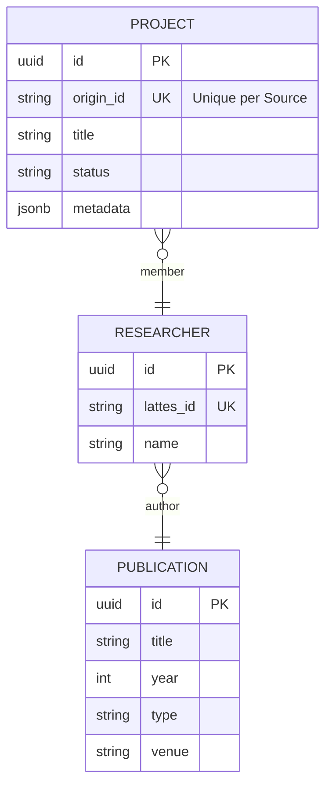

# SI.3 – Projeto de Software (Design)
**Projeto:** Horizon Dashboard
**Versão do Documento:** 1.0
**Data:** 06/01/2026
**Responsável pelo Design:** Antigravity (Senior Designer)

---

## 1. Objetivo do Documento
Definir a Arquitetura Frontend e os padrões de design para o Horizon Dashboard, garantindo acessibilidade, performance e consistência visual.

---

## 2. Visão Geral da Arquitetura
**Estilo Arquitetural:** Static Site Generation (SSG) com Astro
**Padrão de Integração:** Consumo de arquivos JSON Estáticos.

**Diretrizes:**
- **Components (Astro)**: UI modular e acessível.
- **Data (Static)**: Arquivos JSON canônicos consumidos via `import` ou `getStaticPaths`.

---

## 3. Arquitetura de Componentes

### 3.1 Diagrama de Componentes (Mermaid)
```mermaid
flowchart TD
    subgraph Orchestration [src/flows]
        Flow[Prefect Flow]
    end

    subgraph Core [src/core]
        PortSource[<Interface>\nISource]
        PortSink[<Interface>\nISink]
        Logic[Business Logic\nMappers]
        Domain[Domain Entities]
    end

    subgraph Adapters [src/data/canonical]
        Initiatives[initiatives.json]
        Researchers[researchers.json]
        Groups[research_groups.json]
    end

    %% Dependency Injection (Orchestration)
    Flow -.-> PortSource
    Flow -.-> PortSink

    %% Data Flow (ETL)
    PortSource == 1. Extract (Raw Data) ==> Logic
    Logic == 2. Transform (Domain Entities from Lib) ==> PortSink
    PortSink == 3. Load (Persist) ==> ResearchDomainLib
    
    SigPesq --implements--> PortSource
    Lattes --implements--> PortSource
    Fapes --implements--> PortSource
    Cnpq --implements--> PortSource
    
    JsonFile --implements--> PortSink
    
    %% External Libraries
    subgraph SharedKernel [Shared Libraries]
        ResearchDomainLib[Research Domain Lib\n(Entities & Repositories)]
    end
    
    Logic -.uses.-> ResearchDomainLib
    Supabase --extends--> ResearchDomainLib
```

### 3.2 Estrutura de Diretórios (Consolidada)
```text
src/
├── core/                  # BUSINESS RULES (Pure Python)
│   ├── ports/             # Interfaces (Abstract Base Classes)
│   ├── domain/            # Entities (Pydantic Models)
│   └── logic/             # Transformations (Mappers, Cleaners)
│
├── adapters/              # INFRASTRUCTURE (I/O)
│   ├── sources/           # Extractors (Scrapers, API Clients)
│   └── sinks/             # Loaders (Supabase, S3, FileSystem)
│
└── flows/                 # ORCHESTRATION (Prefect)
    └── <flow_name>.py     # Dependency Injection & Execution
```

---

## 4. Modelagem de Dados (Schema Simplificado)

O Dashboard consome arquivos JSON que refletem as Entidades do Domínio.


*Detalhes completos no SI.2 Análise.*

---

## 5. Interfaces e Contratos (Ports)

### 5.1 ISource (`src/core/ports/source.py`)
Contrato para extração de dados.
```python
class ISource(ABC):
    @abstractmethod
    def extract(self) -> List[RawData]:
        """Extrai dados brutos da fonte."""
        pass
```

### 5.2 ISink (`src/core/ports/sink.py`)
Contrato para carga de dados (Idempotent).
```python
class ISink(ABC):
    @abstractmethod
    def load(self, data: List[DomainEntity]) -> LoadStats:
        """Persiste dados cuidando de Upserts/Deduplicação."""
        pass

class IExportSink(ABC):
    @abstractmethod
    def export(self, data: List[DomainEntity], path: str) -> None:
        """Exporta entidades para um formato de arquivo."""
        pass
```

---

## 6. Decisões de Design (ADRs)

| ID | Decisão | Justificativa |
|----|---------|---------------|
| **D1** | **Prefect para Orquestração** | Suporte nativo a Retries, Caching e Observabilidade. |
| **D2** | **Arquivos JSON Estáticos** | Máxima performance e custo zero de infraestrutura. |
| **D3** | **Flows Separados** | `src/flows` isola o framework de orquestração do Core. |
| **D4** | **Consolidação no Core** | Todas as regras e interfaces vivem em `src/core` para evitar dependências circulares. |

---

---

## 8. Data Visualization Mapping (Data Analyst)
| Componente UI | Métrica / KPI | Tipo de Gráfico |
|---------------|---------------|-----------------|
| `KpiCard` | Total de Grupos, Pesquisadores, Projetos | Valor Numérico + Tendência |
| `AreaChart` | Evolução de Projetos (Novos por Ano) | Área / Linhas |
| `DonutChart` | Distribuição de Status de Projetos | Pizza / Donut |
| `VerticalBar`| Participantes por Categoria (Projetos) | Barras Verticais |
| `HorizontalBar`| Top 10 Linhas de Pesquisa | Barras Horizontais (Frequência) |
| `Sunburst` | Áreas do Conhecimento | Radial Hierárquico |
| `MapComponent`| Distribuição de egressos | Mapa Coroplético |
| `Tabs` | Alternância entre Visão Geral e Detalhes Analíticos | Tabs (Visão Geral / Temporal / Composição) |
| `LineChart (Team)` | Evolução da Equipe (Pesquisadores vs Estudantes) | Gráfico de Linha Dupla |
| `BarChart (Pubs)` | Quantidade de Publicações por Pesquisador | Gráfico de Barras |
| `LineChart (Pubs)` | Linha do tempo de Publicações (Evolução) | Gráfico de Linha / Área |

---

## 9. Design Standards – Design Tokens (UX Designer)
| Categoria | Token | Valor (Dark/Light) |
|-----------|-------|--------------------|
| **Acessibilidade**| `--focus-ring` | `ring-2 ring-premium-accent` |
| **Tipografia** | `--font-title` | `'Outfit', sans-serif` |
| **Cores** | `--premium-accent`| `#38bdf8 / #0369a1` (WCAG AA) |
| **Efeito** | `--glass-blur` | `backdrop-blur-md` |
| **Search Filter**| `--filter-active`| `text-premium-accent border-premium-accent bg-premium-accent/10` |
| **Empty State** | `--empty-text` | `text-text-secondary text-sm italic` |

---

## 10. Rastreabilidade
- **SI.1 Requirements**: Mapeados para **Flows**.
- **SI.2 API/DB**: Mapeados para **Sinks** e **Domain**.
- **UX/Data Goals**: Mapeados para **Seções 8 e 9**.
## 5. Arquitetura Frontend (Horizon Dashboard)
**Framework:** Astro (Static Site Generation + Server Side Rendering hybrd)
**Estilização:** Tailwind CSS v4 + Variáveis CSS Semânticas (`global.css`)

### 5.1 Diagrama de Componentes (Frontend)
```mermaid
flowchart TD
    subgraph Pages [src/pages]
        Index[index.astro\n(Lista de Grupos)]
        Detail[[id].astro\n(Detalhes do Grupo)]
        KnowledgeAreas[knowledge-areas/index.astro\n(Dashboard de Áreas)]
    end

    subgraph Layouts [src/layouts]
        MainLayout[Layout.astro]
    end

    subgraph Components [src/components]
        Search[Search.astro]
        Header[Header.astro]
        Sidebar[Sidebar.astro]
        Breadcrumbs[Breadcrumbs.astro]
        Footer[Footer.astro]
    end

    subgraph StaticAssets [public/]
        Images[Logos/Icons]
    end

    Index --> MainLayout
    Detail --> MainLayout
    KnowledgeAreas --> MainLayout
    MainLayout --> Header
    MainLayout --> Sidebar
    MainLayout --> Breadcrumbs
    MainLayout --> Footer
    Index --> Search
```

### 5.2 Estilos e Design System
- **Tema:** Light/Dark Mode automático via classe `.dark` no `html`.
- **Cores Semânticas:**
    - `--bg-primary`: Fundo da página base.
    - `--tag-bg`: Fundo de tags (normalizado para #f1f5f9 em Light Mode).
    - `--premium-accent`: Cor de destaque (Azul/Sky).
- **Glassmorphism:** Uso extensivo de `backdrop-blur` e bordas semi-transparentes para cards.

### 5.3 Estrutura de Diretórios (Frontend)
```text
src/
├── components/        # UI Components (Atomic)
├── layouts/           # Page Wrappers
├── pages/             # Routing (File-based)
│   ├── groups/
│   │   ├── [id].astro # Dynamic Route
│   │   └── index.astro
│   └── index.astro    # Redirect or Home
├── styles/
│   └── global.css     # CSS Variables & Tailwind Directives
└── assets/            # Local images/fonts
```
